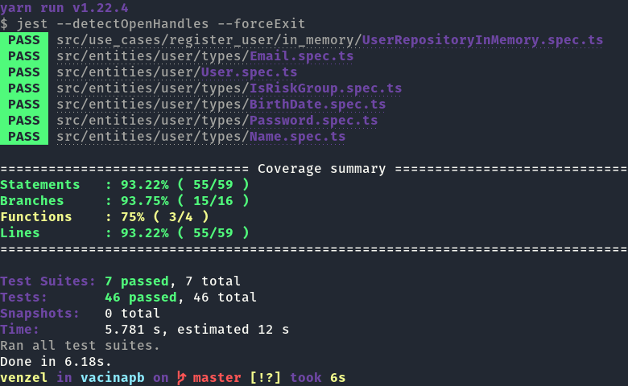

# README

## Atividade de testes (TDD)


A atividade faz parte da disciplina **Testes de Software** ministrada pela Profesora Doutora **Mirna Maia**, que consiste em desenvolver um código orietando a testes (TDD) de um cadastro de usuários, utilizando os seguintes campos:

-   Nome completo
-   Data de nascimento
-   Grupo de risco

O código foi escrito em Typescript, estruturado e baseado em uma Arquitetura Limpa, Design Orientado a Domínio (DDD) e Desenvolvimento Orientado a Testes (TDD), de acordo com ensinamentos de Martin Fowler em seu livro sobre refatoração e arquitetura limpa.

## Entidade principal (usuário)

-   [Usuário](./src/enties/../entities/user/User.ts)

## Arquivos de testes

São realizados testes em nível de: Tipos de dados (types), Entidades e Repositórios.

### 1. Testes em nível de tipos de dados

-   [Nome](./src/entities/user/types/Name.spec.ts)
-   [Data de aniversário](./src/entities/user/types/BirthDate.spec.ts)
-   [Grupo de risco](./src/entities/user/types/IsRiskGroup.spec.ts)

Além dos citados acima, também foram realizados testes em tipos de dados: [Email](./src/entities/user/types/Email.spec.ts) e [Password](./src/entities/user/types/Password.spec.ts)

### 2. Testes em nível de entidade

-   [Entidade usuário](./src/entities/user/User.spec.ts)

### 3. Testes em nível de repositório

-   [Repositório do usuário](./src/use_cases/register_user/in_memory/UserRepositoryInMemory.spec.ts)

Para executar este projeto, siga os sequintes passos:

```bash
# Após clonar o repositório
$ yarn install

# Ou se utiliza o npm:
$ npm install
```

Para rodar a bateria de testes

```bash
# Após clonar o repositório
$ yarn test
```

Resultado:



O código no presente repositório é de autoria de Edivam Enéas de Almeida Júnior.
